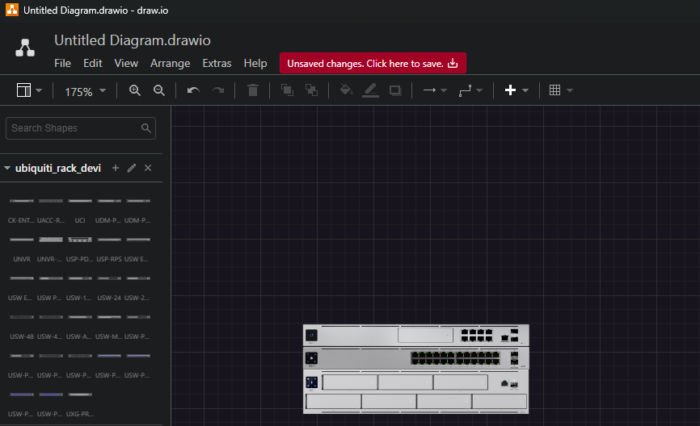
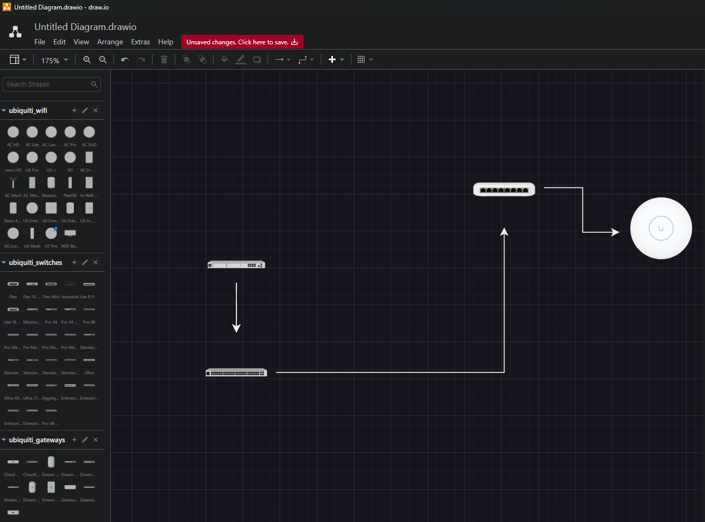

# Ubiquiti-DrawIO-Shapes

This repository contains a collection of `.xml` shape files for [Draw.io](https://draw.io), specifically designed for [Ubiquiti Inc.](https://www.ui.com) devices and racks. These shapes can be used to create network diagrams and rack layouts easily and accurately.

## Table of Contents

- [Ubiquiti-DrawIO-Shapes](#ubiquiti-drawio-shapes)
  - [Table of Contents](#table-of-contents)
  - [Introduction](#introduction)
  - [Installation](#installation)
    - [Locally](#locally)
    - [Directly From Repository](#directly-from-repository)
  - [Shapes Included](#shapes-included)
  - [Examples](#examples)
    - [Rack Example](#rack-example)
    - [Device Example](#device-example)
  - [License](#license)
  - [Disclaimer](#disclaimer)

## Introduction

Ubiquiti-DrawIO-Shapes is a set of custom shapes for [Draw.io](https://draw.io), created to help homelab enthusiasts, network engineers, and IT professionals design network topologies and rack setups using Ubiquiti equipment. The shapes are designed to be as accurate and detailed as possible to represent the actual devices.

This repository includes individual shape libraries for various equipment types as well as combination files that include all devices.

- All device shapes are set at 86 x 86 pts.
- The rack devices include a special version (`ubiquiti_rack_devices.xml`) and are 160 pts wide with a 16 pt height per 1U.

All devices are current as of 16th May 2024.

## Installation

To use these shapes in Draw.io:

### Locally

1. Download the `.xml` files from this repository.
2. Open Draw.io (either the web version or the desktop application).
3. Go to **File > Open Library from > Device**.
4. Select the `.xml` files you downloaded.

The shapes will now be available in your Draw.io shape library.

### Directly From Repository

1. Open Draw.io (web version only).
2. Go to **File > Open Library from > URL**.
3. Enter the RAW link to the file. For example, for all devices: `https://github.com/robmarkoski/ubiquiti-drawio-shapes/raw/master/ubiquiti_devices_all.xml`.
4. Click Open.

## Shapes Included

The following are the shapes included:

| Accessories | Camera Security | Door Security | Gateways | Phone | Racks* | Smart Building | Switches | Wifi AP | 
| --- | --- | --- | --- | --- | --- | --- | --- | --- | 
| Cable Connections for 2 People (4 Ports) | AI DSLR Long Distance | Enterprise Access Hub | Cloud Gateway Ultra | Analog Telephone Adapter | CK-ENTERPRISE | Connect Display | Flex | AC HD | 
| Existing 24U Communications Rack | AI DSLR Wide Angle | Intercom | CloudKey Enterprise | Phone Touch Max Subscription Locked Black | UACC-RACK-PANEL-PATCH-BLANK-24 | Display Cast | Flex 10 GbE | AC Lite | 
| Existing 48U Communications Rack | AI Pro Black | Intercom Viewer | Dream Machine | Phone Touch Max Subscription Unlocked Black | UCI | EV Station | Flex Mini | AC Long Range | 
| LTE Backup | AI Pro White | Reader G2 Black | Dream Machine Pro | Phone Touch Max Subscription Unlocked White | UDM-PRO | EV Station Pro | Industrial | AC Pro | 
| Power Backup | AI Theta | Reader G2 Pro Black | Dream Machine Pro Max | Phone Touch Subscription Locked Black | UDM-PRO-MAX |  | Lite 8 PoE | AC SHD | 
| UniFi® Wall Socket, 2xRJ45 | AI Theta Pro | Reader G2 Pro White | Dream Machine Special Edition | Phone Touch Subscription Locked White | UNVR |  | Lite 16 PoE | nano HD | 
|  | CloudKey+ | Reader G2 White | Dream Router | Phone Touch Subscription Unlocked Black | UNVR-PRO |  | Mission Critical | U6 Pro | 
|  | G3 Flex | Reader Lite | Dream Wall | Phone Touch Subscription Unlocked White | USP-PDU-PRO |  | Pro 24 | UG + | 
|  | G3 Instant | Access Hub | Gateway Lite |  | USP-RPS |  | Pro 24 PoE | XG | 
|  | G4 Bullet |  | Gateway Pro |  | USW ENTERPRISE 24 POE |  | Pro 48 | AC In-Wall | 
|  | G4 Dome |  | UniFi Express |  | USW ENTERPRISEXG 24 |  | Pro 48 PoE | AC Mesh | 
|  | G4 Doorbell |  |  |  | USW PRO AGGREGATION |  | Pro Max 24 | AC Mesh Pro | 
|  | G4 Doorbell Pro |  |  |  | USW-16-POE |  | Pro Max 24 PoE | BeaconHD | 
|  | G4 Instant |  |  |  | USW-24 |  | Pro Max 48 | FlexHD | 
|  | G4 Pro |  |  |  | USW-24-POE |  | Pro Max 48 PoE | In-Wall HD | 
|  | G4 PTZ Industrial |  |  |  | USW-48 |  | Standard 16 PoE | Swiss Army Knife Ultra | 
|  | G5 Bullet |  |  |  | USW-48-POE |  | Standard 24 | U6 Enterprise | 
|  | G5 Dome |  |  |  | USW-AGGREGATION |  | Standard 24 PoE | U6 Enterprise In-Wall | 
|  | G5 Dome Ultra |  |  |  | USW-MISSION-CRITICAL |  | Standard 48 | U6 Extender | 
|  | G5 Flex |  |  |  | USW-PRO-24 |  | Standard 48 PoE | U6 In-Wall | 
|  | G5 Pro |  |  |  | USW-PRO-24-POE |  | Ultra | U6 Long-Range | 
|  | G5 Turret Ultra |  |  |  | USW-PRO-48 |  | Ultra 60W | U6 Mesh | 
|  | Network Video Recorder |  |  |  | USW-PRO-48-POE |  | Ultra 210W | U7 Pro | 
|  | Network Video Recorder Pro |  |  |  | USW-PRO-MAX-24 |  | Aggregation | WiFi BaseStation XG | 
|  | Protect Floodlight |  |  |  | USW-PRO-MAX-24-POE |  | Enterprise 8 PoE |  | 
|  | Protect Viewport |  |  |  | USW-PRO-MAX-48 |  | Enterprise 24 PoE |  | 
|  | AI 360 |  |  |  | USW-PRO-MAX-48-POE |  | Enterprise 48 PoE |  | 
|  | AI Bullet |  |  |  | UXG-PRO |  | Enterprise XG 24 |  | 

## Examples

### Rack Example

Below is an example of the special rack devices.

### Device Example

Below is an example of standard devices.

## License

This project is licensed under the MIT License. See the [LICENSE](LICENSE) file for more details.

## Disclaimer

All items included in this repository are copyright [Ubiquiti Inc.](https://www.ui.com). The use of these shapes is intended for creating network diagrams and rack layouts in Draw.io. This project is not affiliated with or endorsed by Ubiquiti Inc. in any way. All trademarks and registered trademarks are the property of their respective owners.

---

Feel free to reach out if you have any questions or suggestions for additional shapes!
